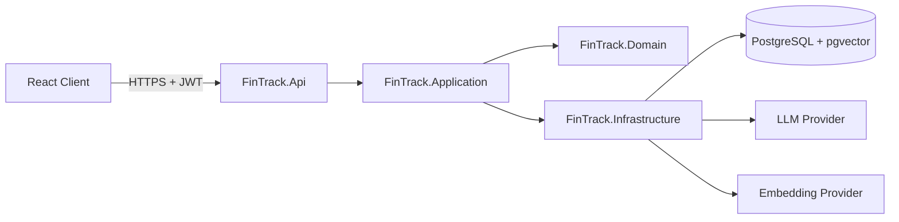

# FinTrack AI — RAG-Based Personal Finance Assistant


A personal finance application where users manage income, expenses, budgets and recurring
payments, review their data with charts, and ask questions about their own finances in natural
language.

The defining design decision: **the LLM never does the math.** Totals, balances, category
breakdowns and budget overruns are computed reliably in backend services with SQL. The language
model is used only to **explain, summarize and interpret** that trusted data — which removes the
"hallucinated number" risk that makes most LLM finance demos untrustworthy.

> **Status:** actively developed in phases. The backend core (authentication, categories,
> transactions) is complete and fully tested. Budgets, dashboard, the React frontend and the
> RAG assistant are the next phases — see the [roadmap](#-project-status--roadmap).

---

## ✨ Features

- **Authentication** — registration, login, JWT access tokens with rotating refresh tokens,
  PBKDF2 password hashing, per-user data isolation.
- **Categories** — per-user categories with income/expense types, default seed set, soft-delete
  (archive) so historical data stays intact, uniqueness enforcement.
- **Transactions** — full CRUD with filtering (date range, category, type, amount range,
  description search), sorting, pagination, and category/type consistency validation.
- **Budgets** — monthly per-category budgets with computed spending, remaining, usage percentage,
  an 80% warning threshold and overrun detection. The math lives in a pure, unit-tested domain
  calculator — never in the (future) LLM.
- **Dashboard** — a single aggregate endpoint returning monthly income/expense/net, month-over-month
  change, category breakdown, daily spending trend, recent transactions, budget status and
  upcoming payments.
- **Recurring transactions** — weekly/monthly/yearly rules with pause/resume, materialized into real
  transactions by a background worker. Generation is idempotent (a rule is never executed twice for
  the same date) and catches up on missed occurrences.
- **React frontend** — TypeScript SPA with login/register, a charted dashboard, and full management
  screens for transactions (filter/sort/paginate), categories, budgets and recurring payments.
  Server state via TanStack Query, forms with React Hook Form + Zod, a JWT axios interceptor with
  controlled logout on 401, and loading/empty/error states throughout.
- **RAG assistant** — ask about your finances in natural language. A rule-based classifier routes the
  question, exact figures are computed by backend services (never by the LLM), semantic context is
  retrieved from the user's own embedding documents via pgvector, and the model only explains the
  result. Provider-agnostic: runs offline with a deterministic fake provider, or OpenAI via config.
  Every retrieval is filtered by user id — a test proves one user's answer never contains another's data.
- **Reliable error handling** — RFC 7807 ProblemDetails for every error, with a trace id.
- **Tested** — 58 tests: unit tests plus integration tests that run against a real PostgreSQL (via
  Testcontainers), including cross-user data-isolation proofs.

Planned: reports with CSV export.

## 🏗️ Architecture

A simplified Clean Architecture — four layers, each with a concrete purpose, no ceremony.



| Layer | Responsibility |
|-------|----------------|
| **Domain** | Entities, enums, domain exceptions. No framework dependencies. |
| **Application** | Use-case services, DTOs, interfaces (`IAppDbContext`, `ICurrentUser`, `IJwtTokenGenerator`, `IPasswordHasher`), FluentValidation. Business rules live here. |
| **Infrastructure** | EF Core `DbContext`, entity configurations, migrations, JWT generation, password hashing. Implements the Application interfaces. |
| **Api** | Thin controllers, middleware (exception → ProblemDetails), DI, auth/CORS/rate-limit config, Swagger. |

Dependencies point inward: `Api → Application → Domain`, with `Infrastructure` implementing
Application abstractions. There is intentionally **no repository layer** — EF Core already
provides the Unit of Work and Repository patterns, so wrapping it again would add complexity
without value.

## 🤖 RAG approach

The assistant separates two access paths and always keeps numeric accuracy in the backend:

| | Structured query | Semantic retrieval |
|---|---|---|
| Example | "How much did I spend this month?" | "What are my grocery habits?" |
| Source | SQL aggregate (exact) | pgvector similarity (approximate) |
| LLM role | Explain the computed result | Explain + interpret |

Pipeline: identify the user from the JWT → classify the question (structured / semantic / mixed)
→ compute exact figures in services and/or retrieve **only that user's** documents from pgvector
→ build a safe context → call the LLM → return the answer with the data period and sources. If
there is not enough data, it says so rather than inventing an answer.

Data isolation is mandatory: every embedding row carries a `UserId`, and every semantic query
filters by it, so one user's data can never surface for another.

## 🧰 Tech stack

**Backend:** .NET 8, ASP.NET Core Web API, Entity Framework Core, PostgreSQL + pgvector,
JWT auth, FluentValidation, Serilog, Swagger / OpenAPI.
**Testing:** xUnit, FluentAssertions, Moq, Testcontainers.
**DevOps:** Docker, docker-compose, GitHub Actions.
**Frontend:** React, TypeScript, Vite, React Router, Axios, TanStack Query, React Hook Form, Zod,
Recharts, Tailwind CSS.

## 🔐 Security

- Passwords hashed with ASP.NET Core's PBKDF2 hasher — never stored in plain text.
- JWT signing secret and any API keys come from **user-secrets / environment variables**, never
  the repository.
- Refresh tokens are stored **hashed**; rotated on every use.
- **Every data query is filtered by the authenticated user id** — accessing another user's record
  returns 404, and this is enforced by integration tests.
- Rate limiting on authentication endpoints (configurable).
- Entities are never returned directly — request/response DTOs guard against over-posting.
- Parameterized queries via EF Core; CORS restricted to the configured origins.

## 🚦 Project status & roadmap

| Phase | Scope | Status |
|-------|-------|--------|
| 1 | Planning & domain model | ✅ |
| 2 | Backend skeleton, entities, DbContext, migrations, error handling | ✅ |
| 3 | Authentication (JWT + refresh, ownership) | ✅ |
| 4 | Categories + Transactions (filtering, pagination, tests) | ✅ |
| 5 | Budgets + Dashboard aggregate endpoint | ✅ |
| 6 | Recurring transactions + background worker | ✅ |
| 7 | React frontend | ✅ |
| 8 | RAG assistant (pgvector, embeddings, LLM) | ✅ |
| 9 | Docker + CI | ✅ (base) |
| 10 | Documentation | ✅ (this README) |

## 🚀 Getting started

### Option A — Docker (everything in one command)

```bash
docker compose up --build
```

- API + Swagger: <http://localhost:8080/swagger>
- PostgreSQL: `localhost:5432`

The database schema is migrated automatically on startup in this mode.

### Option B — Run locally

Prerequisites: .NET 8 SDK and a PostgreSQL with the `pgvector` extension. The quickest way to get
the database is Docker:

```bash
docker run -d --name fintrack-db -e POSTGRES_DB=fintrack -e POSTGRES_USER=fintrack \
  -e POSTGRES_PASSWORD=fintrack -p 5432:5432 pgvector/pgvector:pg16
```

Set the JWT secret (kept out of source via user-secrets) and apply migrations:

```bash
cd backend
dotnet user-secrets set "Jwt:Secret" "a-long-random-secret-at-least-32-characters" \
  --project src/FinTrack.Api
dotnet ef database update --project src/FinTrack.Infrastructure --startup-project src/FinTrack.Api
dotnet run --project src/FinTrack.Api
```

- API + Swagger: <http://localhost:5080/swagger>

### Frontend

With the backend running on `:5080`, start the React client (its dev server proxies `/api` to the
backend, so no CORS setup is needed):

```bash
cd frontend/fintrack-client
npm install
npm run dev
```

- App: <http://localhost:5173>

## ⚙️ Environment variables

See [`.env.example`](.env.example). Key values:

| Variable | Purpose |
|----------|---------|
| `ConnectionStrings__DefaultConnection` | PostgreSQL connection string |
| `Jwt__Secret` | JWT signing secret (**required**, keep out of source) |
| `Jwt__Issuer` / `Jwt__Audience` | JWT issuer / audience |
| `Database__MigrateOnStartup` | When `true`, applies migrations on startup (used by compose) |
| `RateLimiting__Auth__PermitLimit` | Requests allowed per window on auth endpoints |
| `Ai__Provider` | `Fake` (default, no key needed) or `OpenAI` |
| `OpenAI__ApiKey` | OpenAI key — only when `Ai__Provider=OpenAI`; never commit it |

## 🧪 Tests

```bash
cd backend
dotnet test
```

- **Unit tests** — password hashing, JWT generation, validation.
- **Integration tests** — spin up a real PostgreSQL (pgvector) with Testcontainers and exercise
  the full API, including registration/login, transaction CRUD, unique constraints, soft-delete,
  deterministic sorting, and **cross-user data isolation**. Docker must be running.

## 📡 API overview

| Area | Endpoints |
|------|-----------|
| Auth | `POST /api/auth/register` · `POST /api/auth/login` · `POST /api/auth/refresh` · `GET /api/auth/me` |
| Categories | `GET/POST /api/categories` · `PUT/DELETE /api/categories/{id}` |
| Transactions | `GET/POST /api/transactions` · `GET/PUT/DELETE /api/transactions/{id}` |
| Budgets | `GET /api/budgets/{year}/{month}` · `POST /api/budgets` · `PUT/DELETE /api/budgets/{id}` |
| Dashboard | `GET /api/dashboard?year=&month=` |
| Recurring | `GET/POST /api/recurring-transactions` · `PUT/DELETE /api/recurring-transactions/{id}` · `PATCH /api/recurring-transactions/{id}/status` |
| Assistant | `POST /api/assistant/chat` · `GET /api/assistant/conversations` · `GET/DELETE /api/assistant/conversations/{id}` |
| Health | `GET /api/health` |
| _Planned_ | reports (CSV export) |

A ready-to-use request collection is in [`docs/requests.http`](docs/requests.http).

## 🖼️ Screenshots

_Add screenshots of the running app here (Login, Dashboard, Transactions, Budgets). Run the
frontend as described above, or explore the API through Swagger UI._

<!--  -->
<!--  -->

## ⚠️ Known limitations

- Single currency (TRY) in the first release; the model is designed to extend.
- Frontend and RAG assistant are not implemented yet (planned phases).
- No email verification / password reset flow yet.

## 🔭 Future work

Budgets & dashboard, recurring transactions with a background worker, the React frontend with
charts, and the RAG assistant with pgvector semantic search and a provider-agnostic LLM
integration.

## 📄 License

[MIT](LICENSE)
